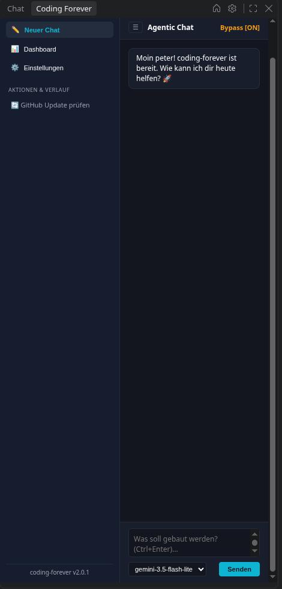
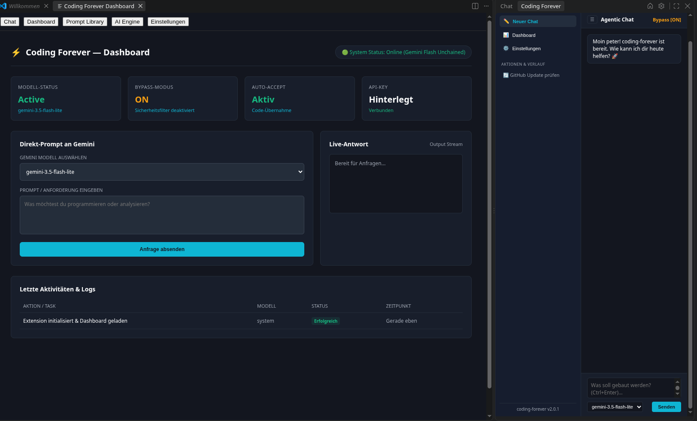
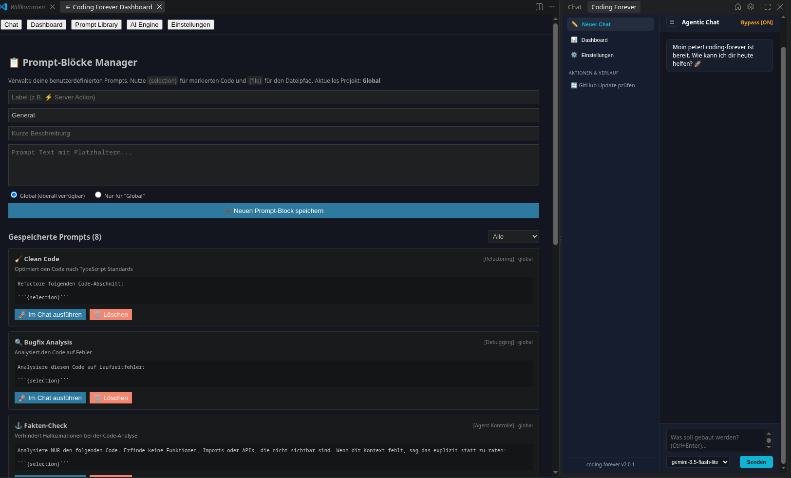
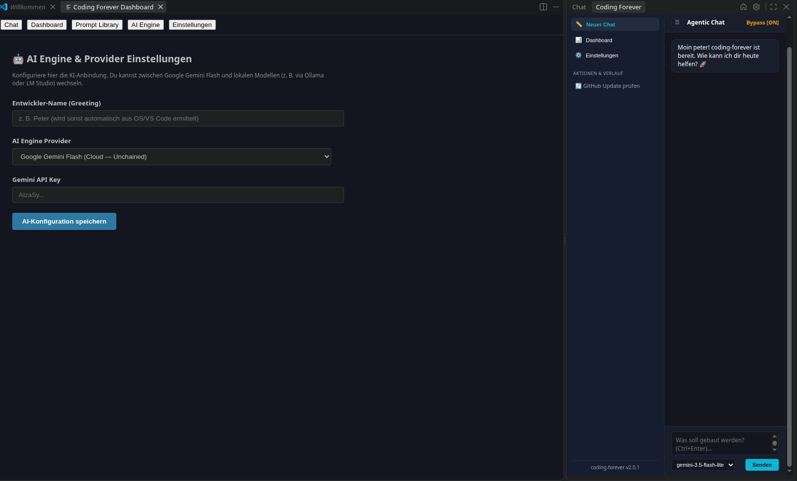
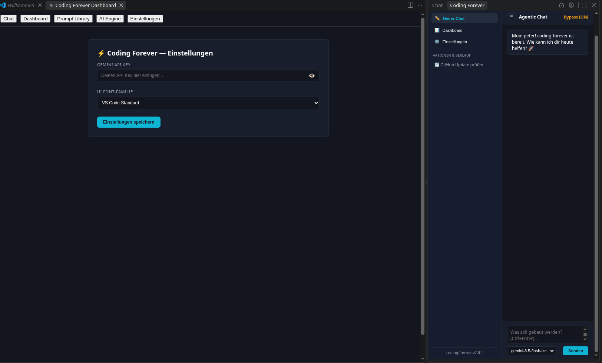

# Coding Forever

**Direct Gemini Flash Integration without Limits** — Die ultimative VS Code Extension für ungedrosselte KI-Entwicklung, angetrieben direkt von der Google Gemini API. Coding wie Du es willst!

---

## Author

* **Peter Päffgen**
* Senior Fullstack Architect
* 40 Jahre am Puls der IT | KI-gestützte Multilevel-Entwicklung | Individuelle KI-Beratung
* **Web:** [https://www.paeffgen-it.de](https://www.paeffgen-it.de)
* **Dev:** [https://github.com/peter1965p](https://github.com/peter1965p)

---

## Features

* **Autonomer Agenten-Modus:** KI führt Datei-Analysen, Erstellungen und Terminal-Befehle selbstständig im Projekt aus.
* **Visuelle Diff-Überwachung:** Volle Kontrolle vor Code-Übernahmen durch native VS Code Diff-Ansichten (`gemini-diff://`).
* **Chat-History & Persistent Storage:** Alle Chat-Nachrichten werden lokal in SQLite gespeichert. Lade frühere Chats mit einem Klick aus dem History-Drawer.
* **Strukturierte Chat-Ausgaben:** Markdown-Support mit Headings, Code-Blöcken, Listen und besserer visueller Hierarchie – wie ein echter AI-Assistant.
* **Chat-Session Management:** Automatische Session-Verwaltung mit Titeln, Timestamps und Lösch-Funktionen direkt in der History.
* **Chat-History Drawer & Header-Badges:** Synchronisierte Verlaufssteuerung und visuelle Status-Badges (`Agent [ON]`, `Bypass [ON]`, `Accept [ON]`) direkt in der Live-Headerleiste.
* **Direkte API-Anbindung:** Kein unnötiges Abo und keine künstlichen Limits – direkter Zugriff auf Claude API, Groq API, Gemini Flash und Pro Modelle.
* **Flexibles Engine-Management:** Nutzen von Groq, Google Gemini oder Einbindung lokaler Modelle (z. B. Ollama) über SQLite-Datenbank-Anbindung.
* **Sicherheitsfilter & Modi:** Dynamic Bypass Mode und Auto-Accept direkt über UI-Switches oder Einstellungen steuerbar.
* **Prompt Manager:** Lokaler SQLite3-basierter Manager mit vordefinierten Prompts & eigenen Vorlagen per Kontext-Variablen (`{selection}`, `{file}`).
* **Native VS Code Quick Fixes:** Direktes Korrigieren von Editor-Fehlern via Code-Actions (Glühbirne) mit einem Klick im Chat.
* **Projektgenerator:** Erstellt neue Node.js-, TypeScript-, React/Vite- und Next.js-Projekte direkt aus VS Code.
* **Plattformübergreifend:** Automatische Erkennung von Windows, macOS und Linux inklusive passender `npm`-/`npx`-Befehle und Pfade.

---

## Voraussetzungen

* VS Code `1.134` oder neuer
* Node.js inklusive `npm` und `npx` für den Projektgenerator
* Internetzugang für die Installation von Projektvorlagen und npm-Paketen

Der Projektgenerator funktioniert auf Windows, macOS und Linux. Die Extension erkennt das Betriebssystem sowie die verfügbaren Node.js-Werkzeuge automatisch.

## Verwendung

1. Installiere die Extension in VS Code, mit: ext install PeterPaeffgen.coding-forever
2. Öffne das **Coding Forever** Icon in der Activity Bar.
3. Trage über das Zahnrad deinen Google Gemini API Key ein ([Hier kostenlos erstellen](https://aistudio.google.com/api-keys)).
4. Wähle dein gewünschtes Modell aus und starte das autonome Coding!

### Neues Projekt erstellen

1. Öffne die Command Palette mit `Strg+Shift+P` unter Windows/Linux oder `Cmd+Shift+P` unter macOS.
2. Starte **Coding Forever: Node-Projekt erstellen**. Alternativ kannst du im Dashboard auf **Neues Node-Projekt erstellen** klicken.
3. Wähle eine Projektvorlage aus:
	* Node.js
	* Node.js + TypeScript
	* React + Vite
	* Next.js
4. Wähle den Zielordner und gib den Namen des neuen Projektordners ein.

Die Extension legt den Projektordner an, führt das passende npm- oder npx-Skript aus und öffnet das fertige Projekt anschließend automatisch in VS Code. Als Standardziel werden vorhandene Ordner in dieser Reihenfolge verwendet:

1. `~/Dev`
2. `~/Documents/Dev`
3. Der Ordner neben dem aktuell geöffneten Workspace
4. Das Home-Verzeichnis

Der Standardpfad kann in den VS-Code-Einstellungen über `codingForever.projectsDirectory` angepasst werden.

---

## Changelog

### 2.7.0
* **AiSettings:** beim Umschalten auf "Lokale Modelle" wird jetzt tatsächlich SCAN_SYSTEM gesendet. Zeigt jetzt immer (nicht nur wenn 0 Ollama-Modelle gefunden werden) die gescannte Hardware + passende Empfehlungen mit Install-Button.

* **Dashboard:** neue "System-Monitor"-Sektion mit echten grafischen Balken für CPU-Load, RAM-Auslastung (%, GB frei), CPU-Temperatur (farbcodiert grün/orange/rot) und GPU-Name. Läuft mit einmaligem vollem Scan beim Öffnen + Live-Polling alle 4s über einen neuen, leichten SCAN_LIVE_STATS-Handler (kein wiederholtes lspci, nur RAM/Temp/Load).
CPU-Temperatur ist ehrlich gesagt nur auf Linux zuverlässig auslesbar (sysfs thermal-zones) – auf Windows/macOS zeigt's sauber "nicht auslesbar" statt einen falschen Wert zu erfinden. cpuLoadPercent genauso: auf Windows liefert os.loadavg() grundsätzlich Unsinn (immer [0,0,0]), da zeigt's ebenfalls ehrlich "nicht messbar" statt einer Fake-Zahl.

* **Scan System Bug:**
Wurde im Backend behoben.

### 2.6.1
* **Problem:**
Agent-Toggle in der UI schickt zwar agentMode mit, aber das Backend liest es nie. handleAgent baut immer den vollen Agent-System-Prompt + alle 4 Tool-Definitionen, egal was man im UI einstellt. Bei openai/gpt-oss-20b mit nur 8000 TPM Free-Tier-Limit reißt das sofort das Limit – auf der Groq-Console selbst schickst man ja nur den nackten Prompt, ohne den ganzen Agent-Overhead.

* **Handle Agent Problem gelöst:** handleAgent() bekommt jetzt einen echten agentMode-Parameter, msg.agentMode aus dem Frontend wird tatsächlich durchgereicht (vorher: totes Feld, nie gelesen).
* **Agent AUS:** schlanker System-Prompt (ein Satz statt der ganzen Anleitung), keine Tools im Request (weder Groq noch Gemini) → massiv weniger Tokens.
* **Agent AN:** alles wie gehabt, volle Agent-Logik + Tools.

### 2.6.0
* **Groq Agentic Chat:** 

* **OPENAI_AGENT_TOOLS:** dieselben vier Tools (list_files, read_file, write_file, run_command) wie bei Gemini, aber im OpenAI-kompatiblen tools/function-Schema, das Groq erwartet.

* **Groq-Pfad umgebaut:** statt einem einzelnen fetch-Call jetzt eine echte Agentic-Loop (max. 10 Turns, wie bei Gemini) – Modell bekommt Tools angeboten, tool_calls werden erkannt, über executeTool() ausgeführt (inkl. Diff-Anzeige vor write_file, Bestätigungs-Dialog wenn autoAccept aus ist), Ergebnis als role: 'tool'-Message zurück in den Verlauf.

* **Filter-Bug gefixt:** fetchGroqModels() schließt jetzt auch orpheus, canopylabs, playai aus – die TTS-Modelle tauchen im Dropdown nicht mehr auf.

### 2.5.0
* **Groq Coding:** Einbindung von dem Groq SDK und allen Groq Modellen in das Modell Menü im Chatmodul
* **Vorbereitung der System auslesung (Hardware)** In der nächsten Revision wird der Hardware scan angepasst für Lokale Modelle

### 2.4.0
* **Projektgenerator:** Neue Projekte können direkt aus VS Code mit Node.js, TypeScript, React/Vite oder Next.js erstellt werden.
* **Automatische Umgebungserkennung:** Windows, macOS und Linux sowie die passenden npm-/npx-Executables und Standardpfade werden automatisch erkannt.
* **Projektordner öffnen:** Nach erfolgreicher Erstellung öffnet die Extension den neuen Projektordner automatisch in VS Code.

### 2.3.1
* **Fix**: Bug Gemini API Key wird nun im VS Code Storage gespeichert

### 2.3.0
* **Chat-History & Persistent Storage:** Alle Chat-Nachrichten werden automatisch in SQLite gespeichert und können über den History-Drawer geladen werden.
* **Strukturierte Chat-Ausgaben:** Vollständige Markdown-Unterstützung mit Headings (`# ## ###`), Code-Blöcken mit Syntax-Highlighting, Bullet-Listen und besserer visueller Struktur.
* **Verbesserte Session-Verwaltung:** Jeder Chat hat eine eindeutige Session-ID, Nachrichten werden mit Timestamps versehen und Sessions lassen sich mit einem Klick wiederherstellen.
* **Dashboard-Version-Anzeige:** Die aktuelle Extension-Version wird jetzt im Dashboard angezeigt.
* **Trash-Funktion:** Chat-Sessions können einzeln aus der History gelöscht werden mit Delete-Button.

### 2.2.2
* **Fix**: Chat lebt wieder, war kurzzeitig nicht da wegen einem Bug. Das Problem mit den 2 API-Keys einmal in Settings und zum anderen in AI Engine. Dies habe ich nun behoben und mich dazu entschieden den API-KEY in die AI Engine zu platzieren. Dort gehört er auch von der Logik her hin.

### 2.2.1
* **Fix**: '/' gespeicherte Prompts sind wieder verfügbar

### 2.2.0
* **Agenten-Modus (Agentic Power):** Der Agent agiert autonom über Tool-Calls (`list_files`, `read_file`, `write_file`, `run_command`), nutzt ein Schritt-Limit von 10 Turns und führt Aktionen dynamisch aus.
* **Visuelle Diff-Überwachung (Visual Diffing):** Vor dem Schreiben von Dateien wird über einen Provider (`gemini-diff://`) ein VS Code Diff-Fenster (Original ↔ Vorschlag) zur Prüfung geöffnet.
* **Chat-History & Verlauf Steuerung:** Klappbarer History-Drawer direkt im Chat-Panel. Der Native Header-Button (`codingForever.openHistory`) fokussiert die Sidebar und toggelt den Verlauf global.
* **Native VS Code Quick Fixes:** Integration über Code-Actions (Glühbirne bei Fehlern), um Fehlerstellen direkt an den Agenten zu übergeben.
* **Header-Status-Badges:** Integrierte Live-Statusanzeigen (`Agent [ON]`, `Bypass [ON]`, `Accept [ON]`) in der oberen Leiste bei eingeklappter History.

### 2.1.0
* Kontextbasierte Prompt-Vorschläge je nach geöffneter Datei im Editor.
* Konstruktive Planerstellung pro Projekt, Volumen und Aufgabenstellung.
* Vollständiges UI-Redesign (Buttons, Switches, Dashboard-Optimierungen).
* **Fix:** Behebung des Instanz-Crashes durch Umstellung von `acquireVsCodeApi()` auf den Singleton `vscodeApi.ts`.

### 2.0.1
* Initiale Veröffentlichung mit Sidebar, Dashboard und direktem Gemini-Support.
* Einführung des **Prompt Managers** mit vordefinierten Prompts & Umstellung auf React-Frontend.
* Lokale SQLite3-Datenbankanbindung für eigene Prompts.
* Anbindung lokaler KI-Modelle (Ollama etc.) über die Einstellungen.

---

## Preview

### Overview

### Dashboard

### Prompt Manager

### AI Engine

### Global Settings
